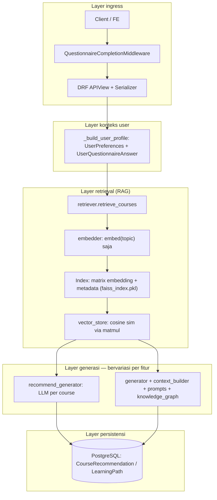

# Arsitektur & Mekanisme Fitur AI

Dokumen ini menjelaskan **layer**, **alur data dari input hingga output**, dan **perbedaan** antara dua fitur AI di backend: **Course Recommendation** dan **Learning Path (Roadmap)**.

**Stack inti:** Retrieval-Augmented Generation (RAG) — **embedding query** (OpenAI) + **pencarian similarity** pada indeks vektor yang disimpan sebagai `faiss_index.pkl`, diikuti **LLM** (OpenAI Chat Completions, model default `gpt-4o`).

**Catatan nama file:** artefak tetap bernama `faiss_index.pkl`, tetapi **implementasi saat ini tidak memakai library FAISS** — pencarian dilakukan dengan **NumPy** (dot product pada vektor ter-normalisasi). Alasan ada di komentar kode: menghindari crash instruksi CPU (AVX) di beberapa runtime serverless.

**Referensi kode utama:** `apps/rag/` (retrieval, generator, recommend), `apps/learning_paths/models.py` (persistensi), `apps/users/middleware.py` (gate kuesioner).

---

## 1. Gambaran pola arsitektur (shared)

Kedua fitur memakai **pipeline RAG yang sama di bagian retrieval**, lalu **berbeda di tahap generasi LLM** (satu panggilan besar berstruktur vs banyak panggilan kecil per course).



### Ringkasan layer

| Layer | Peran | Lokasi / komponen |
|-------|--------|-------------------|
| **Ingress & auth** | JWT; user harus login | DRF `IsAuthenticated` |
| **Gate onboarding** | User tanpa `questionnaire_completed_at` diblokir dari hampir semua `/api/*` kecuali whitelist | `QuestionnaireCompletionMiddleware` |
| **Validasi input** | Schema body request (topic, count, budget, dll.) | `apps/rag/serializers.py` |
| **Profil user** | Skills, goals, level, budget, jam belajar mingguan + ringkasan jawaban kuesioner | `views._build_user_profile` |
| **Embedding query** | Hanya **string `topic`** dari request → vektor (OpenAI `text-embedding-3-small`, cache in-process per 200 karakter pertama). **Profil user tidak mengubah vektor query retrieval.** | `apps/rag/embedder.py` |
| **Index & metadata** | Matriks embedding baris-per-course (L2-normalized) + daftar metadata per baris; file pickle | `index_store`, `vector_store`, `data/rag_index/` |
| **Retrieval** | Cosine similarity, `top_k`, threshold; lampirkan `_score` per course | `apps/rag/retriever.py` |
| **Augment / prompt** | Susun teks untuk LLM (profil + daftar course + optional prereq chain) | `apps/rag/context_builder.py`, `prompts.py`, `knowledge_graph.py` |
| **Generation** | Panggilan OpenAI Chat Completions | `recommend_generator.py` vs `generator.py` |
| **Validasi output** | Parsing JSON; untuk roadmap: Pydantic + cek `course_id` ada di DB | `generator.py` (`schemas.RoadmapOutput`) |
| **Persistensi** | Simpan hasil agar bisa list, saved flag, regenerate | `CourseRecommendation`, `LearningPath`, `LearningPathCourse` |

**Konfigurasi penting:** `apps/rag/config.py` — antara lain `RAG_TOP_K`, `RAG_SIMILARITY_THRESHOLD`, `RAG_MAX_CONTEXT_COURSES`, `OPENAI_MODEL`, `TEMPERATURE`, `MAX_TOKENS`.

---

## 2. Fitur AI #1 — Course Recommendation

**Endpoint utama:** `POST /api/rag/recommend/`

### Alur input → output

1. **Input HTTP:** `topic` (wajib), opsional `additional_context`, `count` (default 5), `regenerate`.
2. **Profil:** `_build_user_profile` menggabungkan `UserPreferences` dan jawaban kuesioner (`variable_key` untuk skills, goals, level, budget, weekly_hours). `additional_context` ditambahkan ke profil jika ada.
3. **Retrieve:** `retrieve_courses(topic, user_profile, top_k=max(count, 20))` — embed `topic`, similarity search pada matriks indeks, kembalikan daftar metadata terurut menurun `_score`.
4. **Truncate:** Ambil hanya `courses[:count]` untuk jumlah rekomendasi yang diminta.
5. **Generate (LLM):** Untuk **setiap** course hasil retrieval, `generate_recommendations` memanggil LLM sekali dengan prompt “user profile + ONE course” dan `response_format=json_object`. Output: `match_score`, `match_reason` (jadi `ai_explanation`), `best_for`, `potential_gaps`.
6. **Fallback:** Jika pipeline LLM gagal total, setiap item tetap punya `relevance_score` dari retrieval vektor tetapi `ai_explanation` = placeholder.
7. **Persist & response:** Upsert ke `CourseRecommendation` (unik per user + course + `topic_input`); response berisi daftar rekomendasi tersimpan + meta `top_similarity_score`, `total_retrieved`, dll.

### Karakteristik

- **Ranking course:** didominasi **cosine similarity vektor** (indeks NumPy, bukan library FAISS), bukan skor LLM global.
- **Biaya/latensi LLM:** **N kali** panggilan API untuk N course (default 5 = 5 panggilan).
- **Temperatur LLM penjelasan:** `0.4` (`recommend_generator._call_explain_llm`).

---

## 3. Fitur AI #2 — Learning Path (Generate Roadmap)

**Endpoint utama:** `POST /api/rag/generate-roadmap/`

### Alur input → output

1. **Input HTTP:** `topic` (wajib), opsional `budget_idr`, `level` — bisa menimpa nilai dari profil DB.
2. **Profil:** Sama seperti rekomendasi; override level/budget dari body jika dikirim.
3. **Retrieve:** `retrieve_courses(topic, user_profile)` dengan `top_k` default dari config (mis. 15 course).
4. **Augment prompt:** `context_builder.assemble_prompt` menyusun:
   - teks profil user;
   - blok **AVAILABLE COURSES** (dibatasi `RAG_MAX_CONTEXT_COURSES`, mis. 12);
   - **prerequisite chain** heuristik: urutan belajar dari metadata retrieval via `knowledge_graph.build_prereq_chain` (sort keyword level: beginner → advanced).
5. **Generate (LLM):** Satu panggilan `generate_roadmap` — system prompt `prompts.SYSTEM_PROMPT` + user prompt berisi schema JSON roadmap (fase, `phase_reason`, `transition_to_next`, course per fase dengan `course_id` UUID, estimasi jam, dll.). `response_format=json_object`, temperatur dari `config.TEMPERATURE` (default 0.3).
6. **Validasi output:** Parse JSON → validasi Pydantic `RoadmapOutput` (fallback ke raw jika perlu) → **filter** course_id yang tidak ada di tabel `courses.Course`.
7. **Persist:** `_save_roadmap_to_db` membuat `LearningPath` + `LearningPathCourse` berurutan (`position`); snapshot JSON penuh disimpan di `questionnaire_snapshot`.
8. **Response:** `LearningPathDetailSerializer` + `_rag_meta` (jumlah course di-retrieve, top similarity score).

### Karakteristik

- **Satu respons LLM besar** yang merangkai **fase**, alasan fase, transisi antar fase, dan pemetaan ke course **hanya dari konteks yang di-retrieve**.
- **Guardrail DB:** course ID halusinasi dibuang; jika semua ID invalid → error.
- **Learning path lanjutan** (di luar “generate pertama”): endpoint terpisah untuk list, detail, regenerate, replace course, similar courses — semuanya tetap berpusat pada model `LearningPath` / retrieval + LLM di modul terkait (`views.py`, `replace_generator.py`).

---

## 4. Perbandingan singkat

| Aspek | Recommendation | Learning Path |
|--------|----------------|----------------|
| **Endpoint** | `POST /api/rag/recommend/` | `POST /api/rag/generate-roadmap/` |
| **Output utama** | Daftar course + penjelasan per course | Roadmap berfase + alasan pedagogis + urutan course |
| **Panggilan LLM** | Banyak (1 × jumlah course) | Satu (per generate) |
| **Penentuan set course** | Top-N similarity lalu dipotong `count` | Top-K similarity; LLM memilih & mengelompokkan ke fase |
| **Model data** | `CourseRecommendation` | `LearningPath` + `LearningPathCourse` |
| **Prerequisite di prompt** | Tidak (fokus course tunggal vs user) | Ya (`build_prereq_chain`) |

---

## 5. Detail retrieval: indeks, embedding, perhitungan skor

Bagian ini menjelaskan **alur angka** dari teks topik hingga daftar course beserta `_score` / `relevance_score`.

### 5.1 Pembangunan indeks (offline) — `build_faiss_index`

Perintah: `python manage.py build_faiss_index` (`apps/rag/management/commands/build_faiss_index.py`).

1. **Sumber data:** semua `Course` dengan `is_active=True` (opsional filter platform / limit).
2. **Chunking:** tiap course → satu **chunk** teks panjang (`chunker.course_to_chunk`): judul, instruktur, level, durasi, rating, harga, platform, potongan description / what_you_learn, tags.
3. **Embedding dokumen:** setiap `chunk['text']` dikirim ke OpenAI Embeddings (`EMBEDDING_MODEL`, default `text-embedding-3-small`) → vektor dimensi tetap (mis. 1536).
4. **Normalisasi baris:** `vector_store.build_faiss_index` membentuk matriks \(M \in \mathbb{R}^{n \times d}\) lalu **setiap baris** dinormalisasi L2:

   \[
   \hat{v}_i = \frac{v_i}{\|v_i\|_2}\quad\text{(jika norma 0, dicegah dengan pengganti 1)}
   \]

5. **Penyimpanan:** satu file `faiss_index.pkl` berisi dict dengan kunci `'embeddings'` (matriks \(M\) sudah normal) dan `'metadata'` (daftar chunk: `course_id`, `text`, `metadata` nested). Singleton di memori di-`load` saat pertama kali dipakai (`index_store.get_faiss_index` / `get_metadata`).

### 5.2 Query saat request (online)

1. **Input retrieval:** hanya **string `topic`** (bukan gabungan profil + topik). Fungsi `retrieve_courses(topic, user_profile, ...)` memanggil `embedder.embed_text_cached(topic)` — cache in-process keyed by **200 karakter pertama** teks yang sama.
2. **Embedding query:** API OpenAI embeddings → vektor \(q \in \mathbb{R}^d\), lalu dinormalisasi:

   \[
   \hat{q} = \frac{q}{\|q\|_2}
   \]

   Jika \(\|q\|_2 = 0\), hasil pencarian kosong.

### 5.3 Rumus skor similarity (yang dipakai sebagai `relevance_score` / `_score`)

Karena **baris indeks** \(\hat{v}_i\) dan **query** \(\hat{q}\) keduanya **unit vector** (L2 = 1), **dot product sama dengan cosine similarity** antara vektor asli sebelum normalisasi:

\[
\text{score}_i = \hat{v}_i^\top \hat{q} = \cos\angle(v_i, q) \in [-1, 1]
\]

Implementasi: satu operasi matriks `scores = index @ query` (lihat `vector_store.search_index`).

**Interpretasi:** semakin mendekati **1**, arah vektor di ruang embedding semakin sejalan → semantik teks course (chunk) semakin mirip teks topik pengguna. Nilai di bawah threshold (default `RAG_SIMILARITY_THRESHOLD` = **0.35**) **dibuang** dan tidak masuk daftar hasil.

### 5.4 Top-K dan urutan

1. Diambil **maksimal `k`** neighbor (parameter `top_k` di pemanggil, atau default `RAG_TOP_K` mis. **15**).
2. Implementasi memakai `np.argpartition` untuk efisiensi lalu **mengurutkan menurun** skor hanya di subset top-`k` tersebut.
3. **Filter threshold** diterapkan **setelah** top-k: course dengan skor &lt; threshold hilang (bisa membuat jumlah hasil &lt; `k`).

`retriever` menyalin metadata ke dict course dan menambahkan `meta['_score'] = score`, serta mencatat **skor tertinggi** di antara yang lolos sebagai `top_score` (dipakai di response meta / `retrieval_info`).

### 5.5 Profil user vs retrieval

Parameter `user_profile` ada di signature `retrieve_courses`, tetapi **tidak dipakai** dalam perhitungan vektor atau ranking saat ini — **personalization retrieval murni lewat LLM** (prompt berisi profil + daftar course hasil topik). Jika nanti ingin hybrid retrieval (mis. embed `topic + ringkasan profil`), itu perlu perubahan kode eksplisit.

### 5.6 Dua jenis “skor” di fitur Recommendation

| Nama di API / DB | Sumber | Arti |
|------------------|--------|------|
| **`relevance_score`** / `_score` | `vector_store.search_index` | Cosine similarity embedding (**topik** vs **teks course**), setelah filter threshold. |
| **`match_score`** | LLM (`recommend_generator`) | Angka 0–1 dari model bahasa: seberapa cocok course itu **dengan narasi profil**; bukan hasil rumus vektor yang sama. |

Keduanya bisa berbeda: course bisa **tinggi similarity** dengan topik tetapi LLM menilai **kurang cocok** dengan level/budget user, atau sebaliknya.

### 5.7 Learning path vs recommendation pada retrieval

- **Roadmap:** `retrieve_courses(topic, user_profile)` → default `top_k = RAG_TOP_K` (mis. 15), tanpa slice di retriever; pemotongan konteks ke LLM lewat `RAG_MAX_CONTEXT_COURSES` (mis. 12) di `context_builder.courses_to_context`.
- **Recommend:** `top_k=max(count, 20)` lalu **`courses[:count]`** — ranking tetap urutan similarity menurun; hanya **N teratas** yang dapat penjelasan LLM per course.

---

## 6. Dependensi eksternal & artefak offline

- **OpenAI API:** embeddings (waktu build indeks + waktu query) + chat completions (generation).
- **Index offline:** file `faiss_index.pkl` di `data/rag_index/` (dan kandidat path lain di `index_store.get_index_path`). Tanpa file valid → `FileNotFoundError` → retriever mengembalikan `[]` → API **404** “no courses”.

---

## 7. Diagram alur ringkas (per fitur)

### Recommendation

```
topic (+optional context) → JWT + questionnaire OK → validate body
  → build user profile → embed(topic) → matrix @ query (cosine sim) → threshold → top_k
  → slice to count → for each course: LLM JSON explanation
  → merge scores + explanations → save CourseRecommendation → JSON response
```

### Learning path

```
topic (+optional level/budget) → JWT + questionnaire OK → validate body
  → build user profile (+overrides) → embed(topic) → cosine top_k
  → build prompt (courses + prereq chain) → single LLM JSON roadmap
  → validate + drop invalid course IDs → save LearningPath + positions
  → serialized learning path + _rag_meta
```

---

## 8. Preprocessing: course, kuesioner, dan request AI

Di codebase ini **“preprocessing”** berbeda menurut sumber data: course banyak dilakukan **saat build indeks** dan lagi **ringan saat menyusun prompt**; kuesioner **tidak** di-embed saat disimpan, melainkan **divalidasi lalu disimpan sebagai kode pilihan**, baru **dirakit jadi teks profil** saat endpoint AI dipanggil.

### 8.1 Course — preprocessing offline (membangun indeks RAG)

**Input:** baris `Course` di PostgreSQL (`is_active=True`), relasi platform & tags.

**Proses** (`chunker.course_to_chunk` + `build_faiss_index`):

| Langkah | Apa yang dilakukan | Tujuan |
|--------|---------------------|--------|
| Agregasi teks | Judul, instruktur, level, durasi, rating, harga, platform, potongan **description max 1000** karakter, **what_you_learn max 800**, tags digabung jadi satu dokumen teks per course | Satu representasi teks untuk embedding |
| Perapihan | `textwrap.fill(..., width=2000)` pada gabungan teks | Membatasi lebar baris (bukan token LLM) |
| Embedding | Batch API OpenAI → vektor per course | Ruang semantic untuk similarity |
| Normalisasi | Setiap vektor baris dinormalisasi L2 (`vector_store.build_faiss_index`) | Dot product = cosine similarity saat search |
| Output | `faiss_index.pkl`: matriks `'embeddings'` + list `'metadata'` (per item: `course_id`, `text`, nested `metadata` untuk UI/retrieval) | Retrieval cepat tanpa query DB per vector |

**Tidak ada** NLP tambahan (stemming, stopword removal) di pipeline ini — yang menentukan kualitas adalah isi field DB + model embedding.

### 8.2 Course — “preprocessing” saat request (hanya untuk LLM, bukan retrieval)

Retrieval memakai **embedding yang sama** dengan saat build indeks (vektor sudah tersimpan). Yang diolah lagi adalah **tampilan teks** course di prompt:

| Langkah | Lokasi | Apa yang dilakukan |
|--------|--------|---------------------|
| Pemformatan per course | `context_builder.course_to_text` | Ambil nested `metadata`, susun baris human-readable; **description** dipendekkan `textwrap.shorten(..., 300)`; **what_you_learn** ke **200** karakter |
| Pembatasan jumlah | `context_builder.courses_to_context` | Hanya **maks. `RAG_MAX_CONTEXT_COURSES`** course pertama (urutan hasil retrieval) yang masuk blok prompt roadmap |
| Urutan bacaan | `knowledge_graph.build_prereq_chain` | Urut ulang **heuristik** (keyword beginner/intermediate/advanced pada title/tags/level) → string “rantai prerequisite” untuk prompt roadmap |

Jadi: **retrieval** pakai vektor penuh dari indeks; **prompt** pakai ringkasan teks agar muat token & mudah dibaca LLM.

### 8.3 Input pengguna — kuesioner & preferensi

#### Saat submit kuesioner (`POST /api/users/questionnaire/`)

**Input:** JSON array, tiap elemen `{ "question_id": "<uuid>", "answer_option": "A" }` (kode pilihan singkat, **bukan** teks bebas panjang).

**Proses validasi** (`_validate_answer_rows` + serializer):

- Jumlah baris **harus sama persis** dengan jumlah `Question` di DB (mis. 32).
- Tidak ada `question_id` duplikat.
- Setiap `answer_option` **harus** menjadi key yang valid di `question.options_json` untuk pertanyaan tersebut.

**Output penyimpanan:** tabel `user_questionnaire_answers` menyimpan **pasangan** `(user, question) → answer_option` (string pendek). **`variable_key`** tetap ada di model `Question` untuk mapping nanti; **tidak** ada embedding jawaban pada tahap ini.

#### Saat pemanggilan fitur AI (`_build_user_profile`)

**Input:** data yang sudah ada di DB — `UserQuestionnaireAnswer` + `UserPreferences` (budget, jam belajar, format materi, dll. lewat endpoint preferensi user).

**Proses (rakitan / “preprocessing” read-time):**

1. Ambil semua jawaban user, urut `question__order_number`.
2. Bentuk `profile['_answers']`: list string `"variable_key atau potongan question_text: nilai_opsi"` untuk konteks narasi di prompt.
3. Untuk setiap jawaban dengan `question.variable_key` terisi, **map** ke field struktural:
   - beberapa key → append ke `current_skills` / `goals`;
   - key level → `profile['level']`;
   - `budget_idr` → parse string ke **int** (strip `IDR`, koma);
   - `weekly_hours` → int jika bisa.
4. Gabungkan dengan field dari `UserPreferences` (bisa ditimpa request body untuk roadmap: `level`, `budget_idr`).

**Tidak ada** normalisasi teks berat atau model terjemahan — ini **rule-based mapping** dari kode opsi + metadata soal.

### 8.4 Input body request fitur AI

| Field | Preprocessing di serializer |
|-------|-----------------------------|
| `topic` | `.strip()`, minimal **3** karakter (`RAGGenerateRequestSerializer` / `RAGRecommendRequestSerializer`) |
| `additional_context` | Opsional; jika `regenerate=True` maka **wajib** non-kosong |
| `count` | Integer 1–20, default 5 |
| `budget_idr` / `level` (roadmap) | Opsional; mengisi/menimpa bagian profil sebelum prompt |

### 8.5 Ringkasan alur **input → proses → output** (end-to-end)

#### A. Jalur data course (sekali / periodik, admin atau CI)

```
Course (DB) → chunker (gabung + potong field teks) → embed_texts (OpenAI)
  → normalisasi L2 → simpan faiss_index.pkl
```

**Output:** file indeks + metadata untuk retrieval.

#### B. Jalur data kuesioner (per user, onboarding)

```
Array {question_id, answer_option} → validasi jumlah & opsi sah
  → bulk_create UserQuestionnaireAnswer → set user.questionnaire_completed_at
```

**Output:** jawaban tersimpan; **belum** ada rekomendasi/roadmap.

#### C. Course recommendation (per request)

```
JWT + middleware (kuesioner selesai)
  → JSON: topic [, count, additional_context, regenerate]
  → serializer (strip topic, rules regenerate)
  → _build_user_profile (baca DB → dict + teks _answers)
  → embed(topic) → similarity di indeks → threshold → top_k → slice count
  → per course: LLM (profil + course_to_text ringkas)
  → simpan CourseRecommendation + response JSON
```

**Output:** daftar course dengan `relevance_score`, `ai_explanation`, `match_score`, dll.

#### D. Learning path / roadmap (per request)

```
(sama ingress & serializer & profil)
  → embed(topic) → similarity → top_k course
  → assemble_prompt: profil + courses_to_context (max N) + prereq_chain
  → satu LLM JSON → validasi + filter course_id
  → simpan LearningPath + LearningPathCourse + response
```

**Output:** entitas learning path + detail course terurut.

---

*Dokumen ini diselaraskan dengan implementasi di repository; bagian preprocessing ditambahkan 2026-05-04.*
